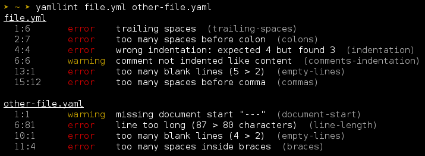

yamllint
========

A linter for YAML files.

yamllint does not only check for syntax validity, but for weirdnesses like key
repetition and cosmetic problems such as lines length, trailing spaces,
indentation, etc.

.. image::
   https://travis-ci.org/adrienverge/yamllint.svg?branch=master
   :target: https://travis-ci.org/adrienverge/yamllint
   :alt: CI tests status
.. image::
   https://coveralls.io/repos/github/adrienverge/yamllint/badge.svg?branch=master
   :target: https://coveralls.io/github/adrienverge/yamllint?branch=master
   :alt: Code coverage status
.. image:: https://readthedocs.org/projects/yamllint/badge/?version=latest
   :target: http://yamllint.readthedocs.org/en/latest/?badge=latest
   :alt: Documentation status

Written in Python (compatible with Python 2 & 3).

Documentation
-------------

http://yamllint.readthedocs.org/

Short overview
--------------

Screenshot
^^^^^^^^^^

Installation
^^^^^^^^^^^^

On Fedora / CentOS:

.. code:: bash

 sudo dnf install yamllint

On Debian 9+ / Ubuntu 16.04+:

.. code:: bash

 sudo apt-get install yamllint

On older Debian / Ubuntu versions:

.. code:: bash

 sudo add-apt-repository -y ppa:adrienverge/ppa && sudo apt-get update
 sudo apt-get install yamllint

Alternatively using pip, the Python package manager:

.. code:: bash

 sudo pip install yamllint

Usage
^^^^^

.. code:: bash

 # Lint one or more files
 yamllint my_file.yml my_other_file.yaml ...

.. code:: bash

 # Lint all YAML files in a directory
 yamllint .

.. code:: bash

 # Use a pre-defined lint configuration
 yamllint -d relaxed file.yaml

 # Use a custom lint configuration
 yamllint -c /path/to/myconfig file-to-lint.yaml

.. code:: bash

 # Output a parsable format (for syntax checking in editors like Vim, emacs...)
 yamllint -f parsable file.yaml

Configuration example
^^^^^^^^^^^^^^^^^^^^^

.. code:: yaml

 extends: default

 rules:
   # 80 chars should be enough, but don't fail if a line is longer
   line-length:
     max: 80
     level: warning

   # don't bother me with this rule
   indentation: disable
